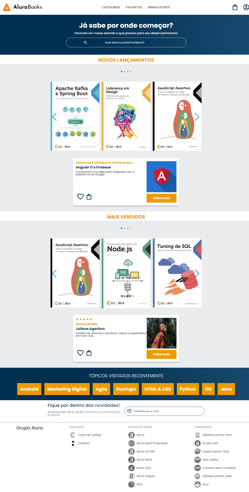

<h1 align="center">AluraBooks</h1>

<h4 align="center">Projeto feito durante o curso de HTML e CSS: responsividade com Mobile-First da Alura.</h4>

 

## Tópicos

  [Tecnologias](#tech) &nbsp;&nbsp;&nbsp;|&nbsp;&nbsp;&nbsp;
  [Projeto](#projeto) &nbsp;&nbsp;&nbsp;|&nbsp;&nbsp;&nbsp;
  [Acesso ao projeto](#acesso)&nbsp;&nbsp;&nbsp;|&nbsp;&nbsp;&nbsp;
  [Status](#status)&nbsp;&nbsp;&nbsp;|&nbsp;&nbsp;&nbsp;
  [Licença](#license)

 

    

    

 

<h2 id="tech">🚀 Tecnologias</h2>

* HTML e CSS
* Git e Github

 

<h2 id="projeto">📚 Projeto</h2>

A AluraBooks é um site que fornece diversos livros relacionados ao mundo da tecnologia que auxiliam nos estudos. Livros das áreas de Front-End e Back-End estão presentes nas estantes da AluraBooks.

 

<h2 id="acesso">🔖 Acesso ao projeto</h2>

Acesse o projeto clicando [aqui](https://fel1324.github.io/AluraBooks/)

 

<h2 id="status">🕒 Status do projeto</h2>

✔️ PROJETO FINALIZADO

 

<h2 id="license">📝 Licença</h2>

Esse projeto está sob a licença MIT.
